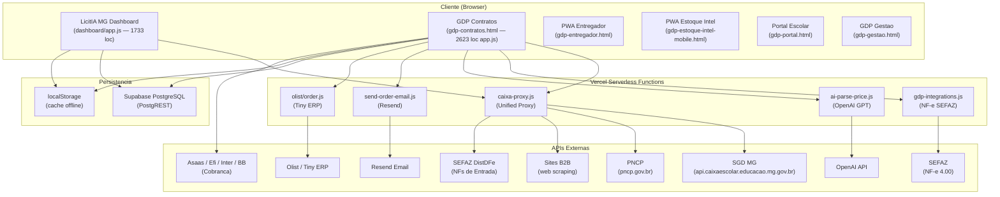

# Arquitetura do Sistema — Painel Caixa Escolar MG

> Documento gerado como parte da **Brownfield Discovery Phase 1** pelo agente @architect (Aria).
> Data: 2026-04-20

---

## 1. Visao Geral

O **Painel Caixa Escolar** (tambem referenciado como **LicitIA MG** e **GDP — Gestao Pos-Licitacao**) e um sistema web para gestao operacional de fornecedores que participam de licitacoes de Caixas Escolares no estado de Minas Gerais.

### Proposito Principal

Automatizar e otimizar o ciclo completo de operacao de um fornecedor de Caixas Escolares MG:

1. **Monitoramento de orcamentos** — Varredura automatica do SGD (Sistema de Gestao de Despesas) do Governo de MG
2. **Pre-cotacao inteligente** — Calculo automatico de precos com base em custos, margens e historico
3. **Envio de propostas** — Submissao de propostas ao SGD via proxy API
4. **Gestao de contratos** — Controle de contratos ganhos em licitacao
5. **Gestao de pedidos** — Criacao, acompanhamento e faturamento de pedidos
6. **Emissao de NF-e** — Geracao, assinatura digital e transmissao de Notas Fiscais Eletronicas via SEFAZ
7. **Logistica de entregas** — Registro de provas de entrega com foto e assinatura
8. **Financeiro** — Contas a receber, contas a pagar, cobranca automatizada
9. **Inteligencia de precos** — Banco de precos com dados do PNCP, historico e simulador de margens
10. **Sincronizacao com ERP** — Integracao com Olist/Tiny ERP para pedidos

### Usuarios

- **Operador/Fornecedor** — Usuario principal que gerencia cotacoes, pedidos e notas fiscais
- **Entregador** — Acesso via PWA mobile para registrar entregas
- Sistema e single-tenant (empresa "Lariucci & Ribeiro Pereira" como tenant padrao `LARIUCCI`)

---

## 2. Stack Tecnologico

| Camada | Tecnologia | Detalhes |
|--------|-----------|----------|
| **Frontend** | HTML/CSS/JavaScript vanilla | SPA-like com modulos JS carregados via `<script>`. Sem framework (React, Vue, etc.) |
| **CSS** | CSS custom properties (variáveis) | Dark theme, design system proprio com variaveis CSS |
| **Build** | Nenhum | Sem bundler, sem transpiler. Arquivos servidos diretamente |
| **Backend API** | Vercel Serverless Functions (Node.js) | Functions na pasta `api/`, max 60s de duracao |
| **Banco de Dados** | Supabase (PostgreSQL gerenciado) | REST API via PostgREST, RLS habilitado em tabelas criticas |
| **Armazenamento local** | localStorage / sessionStorage | Cache local extensivo para operacao offline-first |
| **Autenticacao** | SHA-256 client-side + SGD session cookie | Login local com hash e autenticacao SGD via cookie de sessao |
| **Hospedagem** | Vercel (Hobby plan) | Deploy automatico, limite de 12 serverless functions |
| **Certificado Digital** | PFX/PEM via env vars | Para assinatura XML de NF-e (SEFAZ) |
| **AI/LLM** | OpenAI API (GPT-4o-mini / GPT-4o) | Parse de tabelas de precos e OCR de documentos |
| **Email** | Resend API | Envio de confirmacoes de pedido e cobrancas |
| **Assinatura XML** | xml-crypto + node-forge | Assinatura digital XML para NF-e |
| **PDF** | jsPDF (CDN), pdf.js | Geracao de propostas PDF e leitura de PDFs de fornecedores |
| **Planilhas** | SheetJS (xlsx) via CDN | Import/export de planilhas Excel |
| **PWA** | Service Workers + manifests | Apps mobile para entregador e estoque inteligente |

---

## 3. Diagrama de Arquitetura



---

## 4. Componentes do Sistema

### 4.1 Frontend — Dashboards

O frontend e composto por multiplas paginas HTML independentes, cada uma com seu proprio escopo funcional. Nao ha framework SPA — a navegacao entre modulos acontece via sidebar com troca de visibilidade de secoes.

#### 4.1.1 LicitIA MG Dashboard (`dashboard/app.js` — 1733 linhas)

Dashboard operacional de monitoramento de cotacoes SGD:

- **KPIs**: cotacoes abertas, prazo ate 48h, margem media, receita potencial, pedidos Olist
- **Filtros taticos**: por SRE, municipio, status, busca por objeto
- **Priorizacao**: score de oportunidade (prazo + margem + fit estrategico + confianca)
- **Pre-cotacao**: calculo automatico de precos com exportacao JSON/CSV
- **Simulador de preco/margem**: custo + frete + opex + impostos + margem alvo
- **Tendencia semanal** e **alertas operacionais**
- **Cache com TTL**: `cachedFetch()` com 5min (default) e 15min (heavy)
- **Paginacao**: 50 itens por pagina
- **Auto-refresh**: a cada 60 segundos

#### 4.1.2 GDP Contratos (`squads/caixa-escolar/dashboard/` — app.js 2623 linhas)

Aplicacao principal de gestao pos-licitacao com modulos:

- **Radar SGD** — Varredura de orcamentos, pre-orcamento, envio de propostas
- **Contratos** — CRUD de contratos com itens, vigencia, cliente vinculado
- **Pedidos** — Criacao a partir de contratos, itens, valores, marcadores
- **Notas Fiscais** — Emissao de NF-e real via SEFAZ com assinatura digital XML
- **Entregas** — Provas de entrega com foto e assinatura (PWA)
- **Financeiro** — Contas a receber/pagar, extrato caixa, cobranca automatizada
- **Usuarios/Clientes** — Cadastro de escolas/caixas escolares
- **Banco de Precos** — Catalogo de produtos com custos, margens, concorrentes
- **Pricing Intelligence** — Dashboard analitico de precos com alertas
- **Estoque Inteligente** — Produtos, embalagens, movimentacoes, compras inteligentes
- **Inteligencia de Dados** — Import de tabelas via OCR (GPT-4o), scraping B2B

Modulos JS separados em `js/`:
| Modulo | Responsabilidade |
|--------|-----------------|
| `gdp-core.js` | Sidebar, constantes, data layer, sync, storage |
| `gdp-contratos-module.js` | CRUD de contratos |
| `gdp-pedidos.js` | Gestao de pedidos |
| `gdp-notas-fiscais.js` | Emissao e gestao de NFs |
| `gdp-entregas.js` | Provas de entrega |
| `gdp-usuarios.js` | Cadastro de clientes |
| `gdp-estoque-intel.js` | Estoque inteligente |
| `gdp-banco-produtos.js` | Banco de produtos |
| `gdp-integrations-client.js` | Client-side para NF-e SEFAZ |
| `banco-precos-client.js` | Banco de precos PNCP |
| `gdp-init.js` | Bootstrap e inicializacao |

Modulos de apoio no nivel `squads/caixa-escolar/dashboard/`:
| Arquivo | Funcao |
|---------|--------|
| `app-sync.js` | Cloud sync Supabase (sync_data) |
| `app-sgd-client.js` | Client SGD via proxy |
| `app-sgd-integration.js` | Envio de propostas ao SGD |
| `app-state.js` | Gerenciamento de estado |
| `app-config.js` | Configuracao da empresa |
| `app-import.js` | Importacao de dados |
| `app-banco.js` | Banco de precos local |
| `app-results.js` | Resultados de orcamentos |
| `app-utils.js` | Utilitarios compartilhados |
| `auth.js` | Autenticacao SHA-256 |
| `gdp-api.js` | Data access layer Supabase-first |
| `pricing-intel.js` | Modulo de inteligencia de precos |
| `radar-matcher.js` | Matching de orcamentos com banco de precos |

#### 4.1.3 PWAs Mobile

- **Entregador** (`gdp-entregador.html`) — Service Worker + manifest para instalacao. Registro de entregas com foto e assinatura.
- **Estoque Intel** (`gdp-estoque-intel-mobile.html`) — Interface mobile para gestao de estoque.

### 4.2 Backend API — Vercel Serverless Functions

O backend usa o modelo "proxy unificado" para contornar o limite de 12 functions do Vercel Hobby plan.

#### 4.2.1 `api/caixa-proxy.js` (Unified Proxy — 280 linhas)

Proxy central que roteia por `action` no body da requisicao:

| Action | Funcao | Destino |
|--------|--------|---------|
| `login` | Autenticacao SGD | SGD API |
| `get-user` | Dados do usuario logado | SGD API |
| `list-budgets` | Listar orcamentos por status | SGD API |
| `budget-detail` | Detalhes de um orcamento | SGD API |
| `budget-items` | Itens de um orcamento | SGD API |
| `send-proposal` | Enviar proposta | SGD API |
| `b2b-scrape` | Web scraping de sites B2B | URL externa |
| `sefaz-dist-dfe` | Buscar NFs de entrada | SEFAZ DistDFe |
| `pncp-search` | Pesquisar contratacoes | PNCP API |
| `pncp-items` | Itens de contratacao | PNCP API |
| `pncp-detail` | Detalhes de contratacao | PNCP API |

#### 4.2.2 `api/gdp-integrations.js` (NF-e SEFAZ — 122 linhas)

Integracao fiscal com a SEFAZ para NF-e 4.00:

| Action | Funcao |
|--------|--------|
| `nfe-sefaz-config` | Verificar configuracao do certificado |
| `nfe-sefaz-preview` | Gerar XML assinado sem transmitir |
| `nfe-sefaz-emitir` | Emissao direta (autoriza + retorna) |
| `nfe-sefaz-transmitir` | Transmissao em lote |
| `nfe-sefaz-cancelar` | Evento de cancelamento |
| `nfe-sefaz-inutilizar` | Inutilizacao de faixa de numeracao |
| `nfe-sefaz-debug` | Debug de itens recebidos |

O motor fiscal (`server-lib/nfe-sefaz-client.js` — 1260 linhas) implementa:
- Endpoints SEFAZ para todos os 27 estados (SVAN, SVRS, webservices proprios)
- Assinatura digital XML com `xml-crypto`
- Montagem de envelope SOAP
- Validacao estrutural XSD do payload
- Suporte multi-UF (nao apenas MG)

#### 4.2.3 `api/ai-parse-price.js` (OpenAI — 137 linhas)

Parsing inteligente de tabelas de precos usando LLM:
- **Modo texto**: GPT-4o-mini para extrair itens de texto colado
- **Modo OCR**: GPT-4o para analisar imagens de tabelas
- **Modo cronograma OCR**: GPT-4o para cronogramas de entrega
- Retorna array estruturado de itens com preco, marca, unidade, embalagem

#### 4.2.4 `api/send-order-email.js` (Email — 168 linhas)

Envio de emails de confirmacao de pedido via Resend API:
- Template HTML inline com dados do pedido, NF-e e pagamento
- Attachments: DANFE PDF, XML da NF-e
- Suporte a boleto (linha digitavel) e PIX (copia-e-cola)
- Fallback para modo log quando Resend nao configurado

#### 4.2.5 APIs de Estoque Intel (`api/estoque.js`, `api/produtos.js`, etc.)

APIs para o modulo Estoque Inteligente (dados de sample em memoria):

| Endpoint | Metodo | Funcao |
|----------|--------|--------|
| `/api/produtos` | GET | Listar produtos |
| `/api/estoque` | GET | Posicao de estoque |
| `/api/embalagens` | GET | Embalagens + sugestao de compra |
| `/api/pedidos` | POST | Registrar pedido |
| `/api/compras` | POST | Simular compra inteligente |
| `/api/fornecedores` | GET | Listar fornecedores com ofertas |
| `/api/movimentacoes` | POST | Registrar movimentacao |
| `/api/estoque-intel-erp` | GET | Resumo de integracao ERP |

### 4.3 Banco de Dados — Supabase PostgreSQL

#### 4.3.1 Modelo de Dados

10 tabelas principais definidas em 5 migrations:

| Tabela | Descricao | Chave | Multi-tenant |
|--------|-----------|-------|-------------|
| `empresas` | Empresas fornecedoras | `id TEXT` | Raiz do tenant |
| `clientes` | Escolas / Caixas Escolares | `id TEXT` | `empresa_id` FK |
| `contratos` | Contratos de licitacao | `id TEXT` | `empresa_id` FK |
| `pedidos` | Pedidos de entrega | `id TEXT` | `empresa_id` FK |
| `notas_fiscais` | NF-e emitidas | `id TEXT` | `empresa_id` FK |
| `contas_receber` | Cobrancas | `id TEXT` | `empresa_id` FK |
| `contas_pagar` | Despesas | `id TEXT` | `empresa_id` FK |
| `entregas` | Provas de entrega | `id TEXT` | `empresa_id` FK |
| `resultados_orcamento` | Resultados ganho/perdido | `id TEXT` | RLS habilitado |
| `preco_historico` | Historico unificado de precos | `id TEXT` | RLS habilitado |

Tabelas auxiliares:
| Tabela | Funcao |
|--------|--------|
| `nf_counter` | Sequencia de numeracao NF por empresa |
| `data_snapshots` | Backup point-in-time de tabelas |
| `audit_log` | Audit trail automatico (INSERT/UPDATE/DELETE) |
| `sync_data` | Key-value store legado para sync cloud |

#### 4.3.2 Estrategia de Persistencia (Dual-Layer)

O sistema utiliza uma estrategia hibrida de persistencia:

1. **Supabase-first** (`gdp-api.js`): Para operacoes CRUD, o sistema tenta ler/escrever no Supabase via REST API e faz fallback para localStorage
2. **localStorage cache**: Dados sao sempre salvos localmente para operacao offline
3. **Cloud sync** (`app-sync.js`): Sincronizacao background via tabela `sync_data` (key-value JSONB)
4. **Data migration** (`002_migrate_sync_data.sql`): Script de migracao de sync_data para tabelas normalizadas

#### 4.3.3 Indices e Performance

Indices criados para queries frequentes:
- `empresa_id` em todas as tabelas (filtro de tenant)
- `status` em contratos, pedidos, NFs, contas
- `cnpj` em clientes
- `chave_acesso` em notas_fiscais
- `sku + sre` em preco_historico (analise de precos por regiao)

### 4.4 Scripts CLI (Operacionais)

35 scripts Node.js para operacoes batch e monitoramento:

#### Operacoes Diarias
| Script | Funcao |
|--------|--------|
| `ops-health-check.js` | Verificacao de saude do sistema |
| `ops-alert-check.js` | Checagem de alertas operacionais |
| `ops-status.js` | Status geral das operacoes |
| `generate-ops-daily-report.js` | Relatorio diario de operacoes |
| `generate-ops-eod-summary.js` | Resumo de fim de dia |
| `generate-ops-handoff.js` | Handoff entre turnos |
| `generate-ops-trend.js` | Tendencias operacionais |
| `operational-daily-snapshot.js` | Snapshot diario de dados |
| `export-operational-urgent-csv.js` | Exportar itens urgentes em CSV |

#### Auditorias
| Script | Funcao |
|--------|--------|
| `audit-sku-coverage.js` | Cobertura de SKUs no banco de precos |
| `audit-territory-coverage.js` | Cobertura territorial (SREs/municipios) |
| `validate-sku-coverage.js` | Validacao de cobertura de SKUs |
| `validate-price-history.js` | Validacao de historico de precos |

#### Precos e Cotacoes
| Script | Funcao |
|--------|--------|
| `collect-sgd-orcamentos.js` | Coletar orcamentos do SGD |
| `build-price-history.js` | Construir historico de precos |
| `summarize-price-history.js` | Resumir historico por SKU |
| `fetch-pncp-prices.js` | Buscar precos reais do PNCP |
| `build-sgd-prequote-payload.js` | Montar payloads de pre-cotacao |
| `submit-sgd-prequotes.js` | Submeter pre-cotacoes ao SGD |

#### Integracoes
| Script | Funcao |
|--------|--------|
| `sync-sgd-orders-olist.js` | Sincronizar pedidos SGD com Olist |
| `test-orders-sync-olist.js` | Testar sincronizacao Olist |
| `olist-adapter.js` | Adaptador para API Olist/Tiny |

#### Discovery (Pesquisa de Mercado)
| Script | Funcao |
|--------|--------|
| `discovery-daily-brief.js` | Briefing diario de discovery |
| `discovery-summarize-interviews.js` | Resumir entrevistas |
| `discovery-validate-interviews.js` | Validar entrevistas |
| `discovery-status.js` | Status do ciclo de discovery |
| `discovery-plan-sprint.js` | Planejar sprint de discovery |
| `discovery-next-actions.js` | Proximas acoes |
| `discovery-go-check.js` | Go/No-Go check |
| `discovery-end-day-report.js` | Relatorio de fim de dia |

#### Comercial e Onboarding
| Script | Funcao |
|--------|--------|
| `commercial-kit.js` | Gerar kit comercial |
| `onboarding-start.js` | Iniciar onboarding de nova escola |
| `executive-status.js` | Status executivo geral |
| `serve-dashboard.js` | Servidor local para desenvolvimento |

---

## 5. Integracoes Externas

### 5.1 SGD — Sistema de Gestao de Despesas (MG)

| Aspecto | Detalhe |
|---------|---------|
| **Base URL** | `https://api.caixaescolar.educacao.mg.gov.br` |
| **Autenticacao** | Login CNPJ/senha, cookie `sessionToken` |
| **Proxy** | `caixa-proxy.js` na Vercel (contorna CORS) |
| **Operacoes** | Login, listar orcamentos, detalhar, listar itens, enviar proposta |
| **Headers** | `x-network-being-managed-id` para selecao de rede |

### 5.2 PNCP — Portal Nacional de Contratacoes Publicas

| Aspecto | Detalhe |
|---------|---------|
| **Base URL** | `https://pncp.gov.br/api/consulta/v1` |
| **Autenticacao** | Nenhuma (API publica) |
| **Proxy** | `caixa-proxy.js` (actions `pncp-search`, `pncp-items`, `pncp-detail`) |
| **Uso** | Pesquisa de precos de referencia de atas de registro de preco |

### 5.3 SEFAZ — Secretaria da Fazenda (NF-e 4.00)

| Aspecto | Detalhe |
|---------|---------|
| **Protocolo** | SOAP 1.2 sobre HTTPS com certificado digital A1 |
| **Webservices** | Autorizacao, Inutilizacao, Evento (cancelamento) |
| **Cobertura** | Todos os 27 UFs (webservice proprio, SVAN ou SVRS) |
| **Certificado** | PFX em base64 via env var `NFE_CERT_BASE64` |
| **Assinatura** | xml-crypto (XmlDSig) com node-forge |
| **Ambiente** | Homologacao/Producao via env var `NFE_SEFAZ_AMBIENTE` |

### 5.4 SEFAZ DistribuicaoDFe (NFs de Entrada)

| Aspecto | Detalhe |
|---------|---------|
| **URL** | `https://www1.nfe.fazenda.gov.br/NFeDistribuicaoDFe/NFeDistribuicaoDFe.asmx` |
| **Funcao** | Buscar NFs emitidas contra o CNPJ da empresa |
| **Proxy** | `caixa-proxy.js` (action `sefaz-dist-dfe`) |
| **Parser** | Descompressao gzip dos docZip + parse XML |

### 5.5 Olist / Tiny ERP

| Aspecto | Detalhe |
|---------|---------|
| **Integracao** | Via `olist-adapter.js` e `api/olist/order.js` |
| **Funcao** | Sincronizacao de pedidos confirmados para o ERP |
| **Payload** | Formato Tiny API v2 com cliente, itens, NCM, SKU |
| **Controle** | Feature flag `GDP_ENABLE_ERP_ORDER_SYNC` |
| **Retry** | Max 5 tentativas com backoff exponencial (base 20s) |

### 5.6 OpenAI (GPT-4o / GPT-4o-mini)

| Aspecto | Detalhe |
|---------|---------|
| **Endpoint** | `api/ai-parse-price.js` |
| **Modelos** | GPT-4o-mini (texto), GPT-4o (OCR e cronogramas) |
| **Funcao** | Extrair itens de tabelas de precos em formato estruturado |
| **API Key** | `OPENAI_API_KEY` em env var |
| **Limite** | Texto truncado em 15.000 chars, max 4K-16K tokens de resposta |

### 5.7 Resend (Email Transacional)

| Aspecto | Detalhe |
|---------|---------|
| **Endpoint** | `api/send-order-email.js` |
| **Funcao** | Envio de confirmacao de pedido, NF-e e cobranca |
| **Attachments** | DANFE PDF, XML NF-e |
| **Fallback** | Modo log quando `EMAIL_PROVIDER` != `resend` |

### 5.8 B2B Web Scraping

| Aspecto | Detalhe |
|---------|---------|
| **Proxy** | `caixa-proxy.js` (action `b2b-scrape`) |
| **Funcao** | Buscar precos de fornecedores em sites B2B |
| **Sanitizacao** | Remove scripts, styles, nav, footer; trunca em 15.000 chars |
| **User-Agent** | Simula navegador Chrome |

### 5.9 Provedores Bancarios (Cobranca)

Suporte a multiplos provedores de cobranca via `bank-provider-config.js`:

| Provedor | Suporte |
|----------|---------|
| **Asaas** | Boleto, PIX — client implementado em `asaas-charge-client.js` |
| **Efi (Gerencianet)** | Configurado, client parcial |
| **Banco Inter** | Configurado, client parcial |
| **Banco do Brasil** | Configurado, client parcial |

---

## 6. Fluxo de Dados

### 6.1 Fluxo de Cotacao/Proposta

```
1. Operador abre dashboard
2. Sistema carrega orcamentos do localStorage (cache)
3. Operador clica "Varrer SGD"
4. Frontend → POST /api/caixa-proxy { action: "login" }
5. Frontend → POST /api/caixa-proxy { action: "list-budgets" }
6. Orcamentos renderizados com score de oportunidade
7. Operador monta pre-orcamento (precos do banco + custos + margem)
8. Operador aprova e envia proposta
9. Frontend → POST /api/caixa-proxy { action: "send-proposal" }
10. Resultado salvo no Supabase (resultados_orcamento)
```

### 6.2 Fluxo de Pedido → NF-e → Cobranca

```
1. Contrato ganho cadastrado
2. Pedido criado a partir do contrato (itens, quantidades, precos)
3. Pedido confirmado → sincronizado com Olist/Tiny ERP
4. NF-e gerada:
   a. Frontend → POST /api/gdp-integrations { action: "nfe-sefaz-preview" }
   b. Validacao XSD do payload
   c. Frontend → POST /api/gdp-integrations { action: "nfe-sefaz-emitir" }
   d. XML assinado digitalmente e transmitido à SEFAZ
   e. Chave de acesso e protocolo salvos no Supabase
5. Conta a receber gerada automaticamente
6. Email de confirmacao enviado via Resend com DANFE + XML
7. Cobranca criada no provedor bancario (Asaas)
```

### 6.3 Fluxo de Persistencia (Dual-Layer)

```
Operacao de escrita:
1. Dados salvos no localStorage imediatamente
2. Sync queue agenda upload para Supabase
3. gdp-api.js tenta UPSERT via PostgREST
4. Se falha: dados permanecem no localStorage, retry na proxima sync

Operacao de leitura:
1. gdp-api.js tenta fetch do Supabase (tabela normalizada)
2. Se falha: leitura do localStorage
3. Fallback: leitura da tabela sync_data (formato legado key-value)
```

---

## 7. Modelo de Deploy

### Infraestrutura

| Componente | Provedor | Plano |
|-----------|---------|-------|
| **Hosting + Functions** | Vercel | Hobby (gratuito) |
| **Database** | Supabase | Free tier |
| **Email** | Resend | Free tier |
| **AI** | OpenAI | Pay-per-use |
| **Cobranca** | Asaas | Sandbox/Producao |

### Vercel Configuration (`vercel.json`)

- **Rewrites**: `/api/sgd-proxy` e `/api/b2b-scrape` redirecionados para `/api/caixa-proxy`
- **Redirects**: Raiz (`/`) redireciona para `gdp-contratos.html`
- **Functions**: `caixa-proxy.js`, `ai-parse-price.js`, `gdp-integrations.js` com max 60s de duracao
- **Headers**: `Cache-Control: no-cache` para todos os arquivos HTML

### Estrutura de Deploy

O projeto tem **duas raizes de deploy** que coexistem:

1. **`painel-caixa-escolar/` (raiz)** — Deploy principal no Vercel
   - `api/` → Serverless functions
   - `dashboard/` → Dashboard LicitIA MG
   - `squads/caixa-escolar/dashboard/` → GDP Contratos (app principal)

2. **`squads/caixa-escolar/dashboard/`** — Possui seu proprio `vercel.json` e `package.json`
   - Pode ter sido um deploy independente em algum momento
   - Atualmente servido via a raiz principal

---

## 8. Seguranca

### 8.1 Autenticacao

| Mecanismo | Implementacao | Localizacao |
|-----------|--------------|-------------|
| **Login local** | SHA-256 do password comparado com hash hardcoded | `auth.js` |
| **Sessao** | Hash armazenado em `sessionStorage` | `auth.js` |
| **SGD** | Cookie `sessionToken` obtido via proxy | `caixa-proxy.js` |

**Observacao critica**: O hash da senha esta hardcoded no JavaScript client-side (`auth.js` linha 8). A autenticacao e puramente no frontend — nao ha verificacao server-side.

### 8.2 API Keys e Credenciais

| Credencial | Armazenamento | Exposicao |
|-----------|--------------|-----------|
| **Supabase URL + anon key** | Hardcoded em `gdp-api.js` | Exposta no client-side (esperado para anon key) |
| **SGD credentials** | localStorage (`caixaescolar.sgd.credentials`) | Apenas no browser do usuario |
| **OpenAI API key** | Env var Vercel (`OPENAI_API_KEY`) | Protegida server-side |
| **Resend API key** | Env var Vercel (`RESEND_API_KEY`) | Protegida server-side |
| **Certificado NF-e** | Env var Vercel (`NFE_CERT_BASE64`) | Protegida server-side |
| **Asaas API key** | Env var Vercel (`GDP_BANK_ASAAS_API_KEY`) | Protegida server-side |

### 8.3 CORS

Todas as serverless functions setam `Access-Control-Allow-Origin: *` — sem restricao de origem.

### 8.4 Row Level Security (RLS)

RLS habilitado nas tabelas:
- `resultados_orcamento` — Policy por `empresa_id` via `app.current_empresa_id`
- `preco_historico` — Policy por `empresa_id` via `app.current_empresa_id`

As demais tabelas (contratos, pedidos, NFs, etc.) **nao possuem RLS** ativo — a filtragem e feita apenas na aplicacao.

### 8.5 Audit Trail

- Trigger `audit_trigger()` em 7 tabelas registra INSERT/UPDATE/DELETE em `audit_log`
- Snapshots point-in-time via `snapshot_all()` em `data_snapshots`

---

## 9. Padroes de Codigo

### 9.1 Frontend

- **Vanilla JS** sem frameworks — DOM manipulation direta via `document.getElementById()`
- **Modulos via IIFE** — `gdp-api.js` usa `(function() { ... })()` para encapsulamento
- **Variáveis globais** — Estado da aplicacao em variaveis globais (`quotes`, `orcamentos`, `preOrcamentos`)
- **Nomenclatura** — camelCase para JS, kebab-case para IDs HTML
- **Formatacao** — `Intl.NumberFormat` para BRL, datas em ISO
- **Cache** — Pattern de `cachedFetch()` com Map e TTL
- **Memoizacao** — `memo()` com versioning para invalidacao
- **localStorage intensivo** — ~30 chaves diferentes para estado, cache e config

### 9.2 Backend

- **Serverless functions** — Export default de handler `(req, res) => {}`
- **CommonJS** para a maioria; **ESM** (`export default`) para `caixa-proxy.js`, `ai-parse-price.js`, `send-order-email.js`
- **CORS manual** — `corsHeaders(res)` em cada function
- **Action pattern** — Proxy unificado com `action` no body JSON
- **Error handling** — try/catch com `res.status(500).json({ error: ... })`

### 9.3 Banco de Dados

- **TEXT como PK** — IDs sao strings (UUID ou compostos)
- **JSONB extensivo** — Campos como `itens`, `fiscal`, `sefaz`, `endereco` sao JSONB
- **Trigger para updated_at** — Automatico em todas as tabelas
- **Migracao idempotente** — `ON CONFLICT DO NOTHING` em todos os INSERTs de migracao
- **Nomenclatura** — snake_case no banco, camelCase no JS (com mapeamento em `gdp-api.js`)

### 9.4 Scripts CLI

- **Pattern uniforme** — Leitura de JSON files, processamento, escrita de JSON output
- **Dados em `dashboard/data/`** — 25+ arquivos JSON como "banco de dados" de arquivos
- **npm scripts encadeados** — `ops:daily` encadeia 8 scripts sequencialmente
- **Sem dependencias externas** — Apenas `fs`, `path` e modulos locais

---

## 10. Limitacoes Conhecidas

### 10.1 Arquitetura

| Limitacao | Impacto | Severidade |
|-----------|---------|-----------|
| **Single-tenant hardcoded** | Tenant `LARIUCCI` hardcoded em migrations e fallbacks. Suporte multi-tenant existe no schema mas nao na pratica. | MEDIA |
| **Frontend monolitico** | `app.js` do GDP com 2623 linhas; estado global compartilhado entre modulos via variaveis globais. | ALTA |
| **Sem build system** | Nenhum bundler, minifier ou tree-shaking. Todos os scripts carregados sequencialmente. | MEDIA |
| **Sem testes automatizados** | `npm test` executa apenas um script de teste manual de sync Olist. Sem unit tests, sem CI/CD. | ALTA |
| **Sem TypeScript** | Todo o codigo em JavaScript vanilla sem tipagem estatica. | MEDIA |

### 10.2 Seguranca

| Limitacao | Impacto | Severidade |
|-----------|---------|-----------|
| **Auth client-side only** | Hash da senha exposto no JS. Qualquer pessoa pode acessar o dashboard. | CRITICA |
| **CORS `*`** | Qualquer dominio pode chamar as APIs. | ALTA |
| **Supabase anon key exposta** | Esperado, mas sem RLS na maioria das tabelas = acesso total aos dados. | CRITICA |
| **RLS parcial** | Apenas 2 de 10+ tabelas possuem RLS ativo. | ALTA |
| **Credenciais SGD em localStorage** | CNPJ e senha do SGD salvos sem criptografia no browser. | MEDIA |

### 10.3 Performance e Escalabilidade

| Limitacao | Impacto | Severidade |
|-----------|---------|-----------|
| **Vercel Hobby plan** | Limite de 12 serverless functions (contornado pelo proxy unificado). Limite de 60s por execucao. | MEDIA |
| **localStorage como DB** | ~30 chaves com dados potencialmente grandes. Limite de ~5-10MB por dominio. | ALTA |
| **Sem paginacao server-side** | Queries Supabase sem limit em muitos casos (`?limit=9999`). | MEDIA |
| **JSON files como data store** | 25+ arquivos JSON em `dashboard/data/` servidos como assets estaticos. | MEDIA |
| **Sem CDN para assets** | CSS e JS servidos diretamente, sem minificacao ou cache busting (apenas query string manual `?v=7`). | BAIXA |

### 10.4 Manutenibilidade

| Limitacao | Impacto | Severidade |
|-----------|---------|-----------|
| **Duas raizes de deploy** | `painel-caixa-escolar/` e `squads/caixa-escolar/dashboard/` com codigo duplicado/divergente. | ALTA |
| **Mix de CommonJS e ESM** | Algumas functions usam `module.exports`, outras `export default`. | BAIXA |
| **Dados de sample hardcoded** | APIs de estoque intel usam dados mock em `lib/estoque-intel-data.js`. | MEDIA |
| **Sem versionamento de API** | Endpoints nao possuem prefixo de versao (`/api/v1/`). | BAIXA |
| **Documentacao inline escassa** | Poucos JSDoc, comentarios minimais. Nomes de funcoes sao a principal documentacao. | MEDIA |

---

*Documento gerado por @architect (Aria) — Brownfield Discovery Phase 1*
*Projeto: Painel Caixa Escolar MG / LicitIA MG / GDP*
