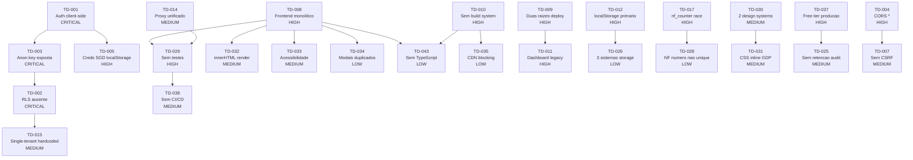

# Technical Debt Assessment — DRAFT

**Projeto:** Painel Caixa Escolar (GDP / LicitIA MG / Licit-AIX)
**Data:** 2026-04-20
**Autor:** @architect (Aria) — Brownfield Discovery Phase 4
**Status:** DRAFT (pendente revisao de especialistas Phase 5-6)

---

## 1. Resumo Executivo

O sistema Painel Caixa Escolar apresenta **divida tecnica significativa concentrada em seguranca e arquitetura frontend**, resultado de um crescimento organico rapido sem governanca tecnica. Os riscos mais criticos envolvem a **exposicao total de dados** por ausencia de autenticacao server-side combinada com RLS parcial no banco, e a **fragilidade operacional** de um frontend monolitico sem testes, sem build system e com estado persistido exclusivamente em localStorage. A base de codigo funciona e entrega valor de negocio, mas esta em um ponto de inflexao onde a adicao de novos features sem remediar a divida tecnica pode levar a incidentes de seguranca e perda de dados. Estima-se que **30-40% do esforco dos proximos 3 sprints** deveria ser alocado para remediacoes antes de iniciar novas funcionalidades de grande porte.

---

## 2. Classificacao de Debitos

### Seguranca

| ID | Severidade | Descricao | Impacto se nao corrigido | Esforco | Dependencias |
|----|-----------|-----------|--------------------------|---------|--------------|
| TD-001 | CRITICAL | Autenticacao puramente client-side (hash SHA-256 hardcoded em `auth.js`) | Qualquer pessoa pode acessar o sistema — basta abrir o DevTools e inspecionar o hash. Zero barreira de entrada. | M | - |
| TD-002 | CRITICAL | RLS ausente em 8 de 13 tabelas operacionais (empresas, clientes, contratos, pedidos, notas_fiscais, contas_receber, contas_pagar, entregas) | Acesso total a dados de TODAS as empresas via anon key exposta. Concorrentes podem ler contratos, precos e dados fiscais. | M | TD-003 |
| TD-003 | CRITICAL | Chave Supabase `anon` exposta em 4+ arquivos JS do frontend sem sessao autenticada | Sem autenticacao via `auth.uid()`, a chave permite CRUD irrestrito em tabelas sem RLS. | L | TD-001 |
| TD-004 | HIGH | CORS `Access-Control-Allow-Origin: *` em todas as serverless functions | Qualquer dominio pode chamar as APIs do sistema, facilitando ataques CSRF e exfiltracao de dados. | S | - |
| TD-005 | HIGH | Credenciais SGD (CNPJ + senha) armazenadas em `localStorage` sem criptografia | Extensoes de browser, XSS ou acesso fisico ao computador expoem credenciais do fornecedor no SGD governamental. | S | TD-001 |
| TD-006 | MEDIUM | `escapeHtml()` existe mas nao e aplicado universalmente em renderizacao `innerHTML` | Vulnerabilidade XSS se dados de terceiros (SGD, PNCP) contiverem payloads maliciosos. | M | - |
| TD-007 | MEDIUM | Sem CSRF protection nas serverless functions | Ataques CSRF podem forcar acoes nao autorizadas (envio de proposta, emissao de NF-e). | S | TD-004 |

### Arquitetura

| ID | Severidade | Descricao | Impacto se nao corrigido | Esforco | Dependencias |
|----|-----------|-----------|--------------------------|---------|--------------|
| TD-008 | HIGH | Frontend monolitico sem framework — `app.js` com 2623 linhas, estado global compartilhado | Impossivel testar, refatorar ou escalar. Cada mudanca pode quebrar funcionalidades nao relacionadas. Bug rate cresce exponencialmente. | XL | - |
| TD-009 | HIGH | Duas raizes de deploy coexistentes (`painel-caixa-escolar/` + `squads/caixa-escolar/dashboard/`) | Codigo duplicado/divergente, confusao sobre qual versao esta ativa, risco de deploy errado. | L | - |
| TD-010 | HIGH | Sem build system (bundler, minifier, tree-shaking) | 14+ scripts carregados sequencialmente bloqueando render. Sem code splitting, sem source maps, sem otimizacao. Performance degradada em redes lentas (escolas rurais de MG). | M | - |
| TD-011 | HIGH | Dashboard legacy (`dashboard/app.js` — 1734 linhas) coexiste com dashboard ativo | Manutencao duplicada, confusao de roteamento, desperdicio de esforco de correcao. | M | TD-009 |
| TD-012 | HIGH | `localStorage` como storage primario (~30 chaves) | Limite 5-10MB, perda total de dados ao limpar browser. Sem sync automatico confiavel, sem conflito de sessao (multiplas abas). | L | TD-002 |
| TD-013 | MEDIUM | Mix de CommonJS e ESM nas serverless functions | Inconsistencia que dificulta refatoracao e impede uso de ferramentas modernas. | S | - |
| TD-014 | MEDIUM | Proxy unificado (`caixa-proxy.js`) como workaround para limite de 12 functions do Vercel Hobby | Unico ponto de falha para 11 actions diferentes. Impossivel monitorar/rate-limit por action individualmente. | M | TD-029 |
| TD-015 | MEDIUM | Single-tenant hardcoded (tenant `LARIUCCI` em migrations e fallbacks) apesar de schema multi-tenant | Impossivel onboardar novos fornecedores sem refatoracao significativa. | M | TD-002 |
| TD-016 | LOW | Sem versionamento de API (endpoints sem prefixo `/api/v1/`) | Breaking changes afetam todos os clientes simultaneamente. | S | - |

### Banco de Dados

| ID | Severidade | Descricao | Impacto se nao corrigido | Esforco | Dependencias |
|----|-----------|-----------|--------------------------|---------|--------------|
| TD-017 | HIGH | Race condition no `nf_counter` — SELECT + UPDATE separados sem `FOR UPDATE` | Duas requisicoes simultaneas podem gerar o mesmo numero de NF, causando rejeicao na SEFAZ e erro fiscal. | S | - |
| TD-018 | HIGH | Ausencia de NOT NULL em colunas financeiras criticas (`pedidos.valor`, `notas_fiscais.valor`, `contas_receber.valor`, `contas_pagar.valor`) | Registros financeiros sem valor geram relatorios incorretos e falhas em integracoes (cobranca, NF-e). | S | - |
| TD-019 | HIGH | Indices ausentes em `contas_receber.vencimento` e `contas_pagar.vencimento` | Full table scan nas queries mais frequentes do dashboard financeiro (contas vencidas). | S | - |
| TD-020 | MEDIUM | 30+ colunas JSONB sem validacao de schema | Dados com estrutura inconsistente causam bugs silenciosos em queries e renderizacao. | L | - |
| TD-021 | MEDIUM | Duplicacao de dados do cliente em 5 locais (tabela + 4 snapshots JSONB) | Atualizacao de cadastro nao propaga; relatorios mostram dados desatualizados. | M | - |
| TD-022 | MEDIUM | `contratos.data_apuracao` como TEXT em vez de DATE | Valores invalidos aceitos silenciosamente; queries temporais impossveis. | S | - |
| TD-023 | MEDIUM | Funcao `set_updated_at()` referenciada em migration 004 mas nao definida | `updated_at` de `resultados_orcamento` pode nunca ser atualizado automaticamente. | S | - |
| TD-024 | MEDIUM | PKs do tipo TEXT (36 bytes) em vez de UUID nativo (16 bytes) | Indices 2.25x maiores, joins mais lentos, aceita strings invalidas como PK. | XL | - |
| TD-025 | MEDIUM | Tabelas `data_snapshots` e `audit_log` sem politica de retencao | Crescimento ilimitado — pode consumir toda a quota do Supabase Free Tier em meses. | M | - |
| TD-026 | LOW | Coexistencia de 3 sistemas de storage: `sync_data`, `nexedu_sync`, tabelas normalizadas | Dados dessincronizados, complexidade desnecessaria, bugs de inconsistencia. | L | TD-012 |
| TD-027 | LOW | FK ausente entre `contas_receber.origem_id` e `notas_fiscais.id` | Contas podem referenciar notas inexistentes. | S | - |
| TD-028 | LOW | Indice `idx_nfs_numero` nao e UNIQUE por empresa/serie | NFs duplicadas permitidas, causando rejeicao SEFAZ. | S | TD-017 |

### Frontend

| ID | Severidade | Descricao | Impacto se nao corrigido | Esforco | Dependencias |
|----|-----------|-----------|--------------------------|---------|--------------|
| TD-029 | HIGH | Sem testes automatizados (unit, integration, e2e) — `npm test` executa apenas um script manual | Regressoes silenciosas a cada mudanca. Impossivel refatorar com confianca. | XL | - |
| TD-030 | MEDIUM | Dois sistemas de design inconsistentes (verde-escuro no Radar vs azul-escuro no GDP) | Confusao visual para usuario, manutencao CSS duplicada. | M | - |
| TD-031 | MEDIUM | CSS inline massivo em paginas GDP (~200 linhas por pagina repetidas) | Manutencao multiplicada por N paginas; inconsistencias visuais frequentes. | M | TD-030 |
| TD-032 | MEDIUM | Renderizacao via `innerHTML` sem Virtual DOM ou diffing | Re-renderizacao completa a cada interacao; perda de estado de inputs; memory leaks por event listeners nao removidos. | L | TD-008 |
| TD-033 | MEDIUM | Acessibilidade nivel BAIXO — sem ARIA, sem focus management, sem keyboard navigation | Exclusao de usuarios com deficiencia; nao-conformidade com legislacao (Lei 13.146/2015). | L | TD-008 |
| TD-034 | LOW | 9 modais em uma unica pagina sem reuso | Duplicacao de logica de modal, inconsistencia de comportamento, complexidade desnecessaria. | M | TD-008 |
| TD-035 | LOW | CDN dependencies (7 bibliotecas) carregadas no head bloqueando render | First Contentful Paint degradado, especialmente em conexoes lentas. | S | TD-010 |
| TD-036 | LOW | Emojis como icones (sem alternativa textual para screen readers) | Renderizacao inconsistente entre OS/browsers; inacessivel. | S | TD-033 |

### Infraestrutura

| ID | Severidade | Descricao | Impacto se nao corrigido | Esforco | Dependencias |
|----|-----------|-----------|--------------------------|---------|--------------|
| TD-037 | HIGH | Vercel Hobby plan (gratuito) + Supabase Free Tier em producao com dados fiscais reais | Limites de request, database size e storage podem ser atingidos a qualquer momento. Sem SLA, sem suporte. Dados de NF-e (obrigacao fiscal) em infra sem garantia. | M | - |
| TD-038 | MEDIUM | Sem CI/CD pipeline | Deploy manual, sem gates de qualidade, sem rollback automatico. | M | TD-029 |
| TD-039 | MEDIUM | Sem monitoramento de erros (Sentry, LogRocket, etc.) | Erros em producao passam despercebidos ate que usuario reporte manualmente. | S | - |
| TD-040 | MEDIUM | Certificado digital NF-e (PFX) em env var base64 | Rotacao do certificado requer redeploy. Sem alerta de expiracao. | S | - |
| TD-041 | LOW | JSON files como data store (`dashboard/data/` — 25+ arquivos) | Dados estaticos servidos como assets; sem atualizacao em tempo real; requer redeploy para atualizar. | M | - |

### Documentacao e Testes

| ID | Severidade | Descricao | Impacto se nao corrigido | Esforco | Dependencias |
|----|-----------|-----------|--------------------------|---------|--------------|
| TD-042 | MEDIUM | Documentacao inline escassa (poucos JSDoc, comentarios minimais) | Onboarding de novos desenvolvedores extremamente lento; conhecimento concentrado em uma pessoa. | L | - |
| TD-043 | LOW | Sem TypeScript | Erros de tipo descobertos apenas em runtime; refatoracao arriscada; autocompletion limitado. | XL | TD-008, TD-010 |

---

## 3. Mapa de Calor

Concentracao de divida tecnica por area e severidade:

```
                    CRITICAL    HIGH       MEDIUM     LOW        TOTAL
                    --------    ----       ------     ---        -----
Seguranca           |####|      |##|       |##|       |  |       7
Arquitetura         |    |      |#####|    |####|     |# |       9
Banco de Dados      |    |      |###|      |#####|    |###|      12
Frontend            |    |      |# |       |#####|    |###|      8
Infraestrutura      |    |      |# |       |###|      |# |       5
Doc/Testes          |    |      |  |       |# |       |# |       2
                    --------    ----       ------     ---        -----
TOTAL               3           11         16         13         43
```

**Legenda:** Cada `#` = 1 item de divida tecnica

### Concentracao por Arquivo/Componente

| Componente | Items TD | Risk Score |
|-----------|----------|------------|
| `auth.js` / Autenticacao | TD-001, TD-003, TD-005 | CRITICAL |
| Supabase RLS / Policies | TD-002, TD-003, TD-015 | CRITICAL |
| `gdp-contratos.html` + `app.js` (2623 loc) | TD-008, TD-029, TD-032, TD-034 | HIGH |
| `caixa-proxy.js` (Unified Proxy) | TD-004, TD-007, TD-014 | HIGH |
| `nf_counter` / NF-e numeracao | TD-017, TD-028 | HIGH |
| `localStorage` state | TD-012, TD-026 | HIGH |
| Deploy infrastructure | TD-009, TD-037 | HIGH |
| Design System / CSS | TD-030, TD-031, TD-033, TD-036 | MEDIUM |
| Migrations / Schema | TD-018, TD-020, TD-022, TD-023, TD-024, TD-025 | MEDIUM |

---

## 4. Dependencias entre Debitos



### Cadeia Critica (Caminho mais longo de dependencias)

```
TD-001 (Auth) → TD-003 (Anon Key) → TD-002 (RLS) → TD-015 (Multi-tenant)
```

Esta cadeia representa o risco #1 do sistema: sem autenticacao real, a chave exposta da acesso total ao banco sem RLS.

---

## 5. Plano de Remediacao Sugerido

### Sprint 0 — Seguranca (MUST antes de qualquer feature nova)

**Duracao estimada:** 2-3 semanas
**Objetivo:** Eliminar vetores de acesso nao autorizado a dados.

| Prioridade | TD | Acao | Esforco | Owner sugerido |
|------------|-----|------|---------|----------------|
| P0.1 | TD-002 | Habilitar RLS em TODAS as 11 tabelas + criar policies por `empresa_id` | M | @data-engineer |
| P0.2 | TD-001 | Implementar autenticacao server-side (Supabase Auth ou JWT customizado) | M | @dev |
| P0.3 | TD-003 | Migrar frontend para usar sessao autenticada (nao anon key direta) | M | @dev |
| P0.4 | TD-004 | Restringir CORS para dominios conhecidos (vercel app URL) | S | @dev |
| P0.5 | TD-017 | Criar funcao atomica `next_nf_number()` com `FOR UPDATE` | S | @data-engineer |
| P0.6 | TD-023 | Criar/corrigir funcao `set_updated_at()` na migration | S | @data-engineer |

**Criterio de saida:** Nenhuma operacao de CRUD possivel sem sessao autenticada; RLS ativo em todas as tabelas; race condition de NF eliminada.

---

### Sprint 1 — Fundacao Arquitetural

**Duracao estimada:** 3-4 semanas
**Objetivo:** Estabilizar a base para permitir evolucao futura.

| Prioridade | TD | Acao | Esforco | Owner sugerido |
|------------|-----|------|---------|----------------|
| P1.1 | TD-010 | Introduzir build system minimo (Vite para dev + bundle) | M | @dev |
| P1.2 | TD-009/TD-011 | Consolidar para uma unica raiz de deploy; deprecar dashboard legacy | L | @architect + @dev |
| P1.3 | TD-012 | Migrar estado critico de localStorage para Supabase-first (garantir sync) | L | @dev |
| P1.4 | TD-018 | Adicionar NOT NULL em colunas financeiras | S | @data-engineer |
| P1.5 | TD-019 | Criar indices em vencimento (contas_receber, contas_pagar) | S | @data-engineer |
| P1.6 | TD-029 | Setup de framework de testes (Vitest ou Jest) + primeiros 10 unit tests em funcoes criticas | M | @qa + @dev |
| P1.7 | TD-037 | Avaliar e migrar para plano pago (Vercel Pro + Supabase Pro) ou alternativa | M | @devops |
| P1.8 | TD-039 | Integrar monitoramento de erros (Sentry free tier) | S | @devops |

**Criterio de saida:** Build system funcional; uma raiz de deploy; dados financeiros seguros no banco; framework de testes operando.

---

### Sprint 2 — Qualidade e Manutencao

**Duracao estimada:** 3-4 semanas
**Objetivo:** Reduzir fricao de desenvolvimento e melhorar qualidade percebida.

| Prioridade | TD | Acao | Esforco | Owner sugerido |
|------------|-----|------|---------|----------------|
| P2.1 | TD-030/TD-031 | Unificar design tokens em um unico arquivo CSS; extrair styles das paginas GDP | M | @ux-design-expert + @dev |
| P2.2 | TD-008 | Iniciar decomposicao do `app.js` monolito em modulos ES (top-down: extrair componentes reutilizaveis) | L | @dev |
| P2.3 | TD-022 | Alterar `contratos.data_apuracao` para DATE | S | @data-engineer |
| P2.4 | TD-020 | Adicionar CHECK constraints nos status de todas as tabelas | S | @data-engineer |
| P2.5 | TD-025 | Implementar politica de retencao para `data_snapshots` (30 dias) e `audit_log` (90 dias) | M | @data-engineer |
| P2.6 | TD-038 | Configurar CI/CD basico (GitHub Actions: lint + test + deploy) | M | @devops |
| P2.7 | TD-042 | Adicionar JSDoc nas funcoes mais criticas (gdp-api.js, nfe-sefaz-client.js) | M | @dev |
| P2.8 | TD-013 | Padronizar serverless functions para ESM | S | @dev |

**Criterio de saida:** Design system unificado; modularizacao iniciada; constraints de integridade no banco; CI/CD ativo.

---

### Sprint 3+ — Evolucao e Nice-to-have

**Duracao estimada:** Ongoing
**Objetivo:** Melhorias incrementais de qualidade de vida.

| Prioridade | TD | Acao | Esforco | Owner sugerido |
|------------|-----|------|---------|----------------|
| P3.1 | TD-033 | Implementar ARIA basico em tabs, modais e widgets interativos | L | @ux-design-expert |
| P3.2 | TD-043 | Iniciar migracao gradual para TypeScript (novos arquivos first) | XL | @dev |
| P3.3 | TD-026 | Deprecar e remover `sync_data` + `nexedu_sync` apos estabilizacao | L | @data-engineer |
| P3.4 | TD-024 | Avaliar migracao de TEXT PKs para UUID nativo (se necessario por performance) | XL | @data-engineer |
| P3.5 | TD-032 | Introduzir rendering library leve (Preact, Lit, ou Web Components) | XL | @architect + @dev |
| P3.6 | TD-034/TD-036 | Substituir modais duplicados por componente reutilizavel; emojis por SVG icons | M | @dev |
| P3.7 | TD-016 | Adicionar versionamento de API (`/api/v1/`) | S | @dev |
| P3.8 | TD-015 | Implementar multi-tenancy real (onboarding de novos fornecedores) | L | @architect + @dev |
| P3.9 | TD-041 | Migrar JSON data files para queries Supabase em tempo real | M | @dev |
| P3.10 | TD-040 | Implementar rotacao e alerta de expiracao de certificado digital | S | @devops |

---

## 6. Custo de Nao-Acao

### Cenario: Continuar sem remediar a divida tecnica

| Timeframe | Risco | Probabilidade | Impacto |
|-----------|-------|---------------|---------|
| **Imediato (0-30 dias)** | Acesso nao autorizado a dados fiscais e comerciais via anon key + RLS ausente | ALTA | Vazamento de dados de contratos, precos e NFs para concorrentes |
| **Curto prazo (1-3 meses)** | NF-e duplicada por race condition no `nf_counter` | MEDIA | Rejeicao SEFAZ, impossibilidade de emitir NF ate correcao manual; multa fiscal potencial |
| **Curto prazo (1-3 meses)** | Perda de dados de pre-orcamentos e configuracoes por limpeza de browser | MEDIA | Retrabalho completo de precificacao; perda de oportunidades de licitacao |
| **Medio prazo (3-6 meses)** | Atingimento de limite do Supabase Free Tier (500MB storage) por `data_snapshots` e `audit_log` sem retencao | ALTA | Sistema para de funcionar abruptamente; dados inacessiveis ate upgrade |
| **Medio prazo (3-6 meses)** | Impossibilidade de adicionar novos modulos ao frontend monolito sem regressoes graves | ALTA | Velocidade de desenvolvimento reduzida para ~30% da capacidade atual |
| **Longo prazo (6-12 meses)** | Desenvolvedor principal fica indisponivel sem documentacao ou testes | MEDIA | Projeto inteiro fica sem manutencao; bus factor = 1 |
| **Longo prazo (6-12 meses)** | Requisitos de compliance (LGPD, auditoria fiscal) exigem logs e seguranca que nao existem | MEDIA | Impossibilidade de continuar operando sem remediacao emergencial |

### Custo Financeiro Estimado de Nao-Acao

- **Vazamento de dados:** Perda de vantagem competitiva em licitacoes (R$ 50-200K/ano em receita de contratos)
- **NF-e rejeitada:** Multa SEFAZ + atraso de faturamento (R$ 5-20K por incidente)
- **Perda de dados localStorage:** Retrabalho de 4-8h por ocorrencia (R$ 500-1000 em horas improdutivas)
- **Indisponibilidade Supabase:** 1-3 dias sem sistema = perda de deadlines de licitacao (R$ 10-50K em oportunidades)
- **Reescrita emergencial (pior caso):** Se divida acumular 12+ meses, custo de reescrita estimado em R$ 150-300K

---

## 7. Quick Wins

Itens de **alto valor com baixo esforco** que podem ser implementados imediatamente:

| # | TD Ref | Acao | Esforco | Valor | ROI |
|---|--------|------|---------|-------|-----|
| QW-1 | TD-004 | Restringir CORS para `*.vercel.app` e dominio de producao | 1h | Elimina vetor de ataque CSRF | ALTISSIMO |
| QW-2 | TD-019 | `CREATE INDEX idx_cr_vencimento ON contas_receber(vencimento); CREATE INDEX idx_cp_vencimento ON contas_pagar(vencimento);` | 5min | Dashboard financeiro 10-50x mais rapido | ALTISSIMO |
| QW-3 | TD-023 | `CREATE OR REPLACE FUNCTION set_updated_at() RETURNS TRIGGER AS $$ BEGIN NEW.updated_at = now(); RETURN NEW; END; $$ LANGUAGE plpgsql;` | 5min | Corrige trigger quebrado silenciosamente | ALTO |
| QW-4 | TD-017 | Criar funcao `next_nf_number(empresa_id)` com `FOR UPDATE` | 30min | Elimina risco de NF-e duplicada | ALTO |
| QW-5 | TD-022 | `ALTER TABLE contratos ALTER COLUMN data_apuracao TYPE DATE USING data_apuracao::DATE;` | 10min | Habilita queries temporais | ALTO |
| QW-6 | TD-018 | Adicionar `NOT NULL DEFAULT 0` em colunas de valor financeiro | 15min | Elimina pedidos/NFs sem valor | ALTO |
| QW-7 | TD-028 | `CREATE UNIQUE INDEX idx_nfs_unique ON notas_fiscais(empresa_id, numero, serie);` | 5min | Previne NF duplicada no banco | ALTO |
| QW-8 | TD-035 | Mover scripts CDN de `<head>` para `<body>` com `defer` | 30min | Melhora FCP em 1-3s | MEDIO |
| QW-9 | TD-039 | Adicionar Sentry free tier (1 script tag + init) | 1h | Visibilidade de erros em producao | MEDIO |

**Total de Quick Wins:** ~4h de trabalho para eliminar 9 debitos/riscos.

---

## Apendice A — Matriz de Risco Consolidada

```
PROBABILIDADE
    ALTA    | TD-002, TD-025, TD-012 |  TD-008, TD-029   |
    MEDIA   | TD-001, TD-003, TD-017 |  TD-037, TD-011   |
    BAIXA   |        TD-007          |  TD-024, TD-043   |
            |------------------------|--------------------| 
            |     ALTO IMPACTO       |   MEDIO IMPACTO   |
                              IMPACTO
```

## Apendice B — Resumo Quantitativo

| Metrica | Valor |
|---------|-------|
| Total de debitos identificados | 43 |
| CRITICAL | 3 (7%) |
| HIGH | 11 (26%) |
| MEDIUM | 16 (37%) |
| LOW | 13 (30%) |
| Esforco total estimado | ~6-8 sprints (assumindo sprint de 2 semanas) |
| Quick Wins disponiveis | 9 (implementaveis em 1 dia) |
| Bus Factor atual | 1 |
| Cobertura de testes | 0% |
| RLS coverage | 15% (2/13 tabelas) |

---

*Documento DRAFT gerado por @architect (Aria) — Brownfield Discovery Phase 4*
*Pendente revisao: @data-engineer (Phase 5), @ux-design-expert (Phase 6), @qa (Phase 7)*
