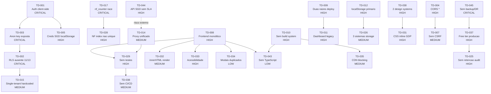

# Technical Debt Assessment — FINAL

**Projeto:** Painel Caixa Escolar (GDP / LicitIA MG / Licit-AIX)
**Data:** 2026-04-20
**Autor:** @architect (Aria) — Brownfield Discovery Phase 8
**Status:** FINAL (aprovado pelo QA Gate - Phase 7)
**Versao:** 1.0

---

## 1. Resumo Executivo

O sistema Painel Caixa Escolar apresenta **divida tecnica significativa concentrada em seguranca, integridade de dados e arquitetura frontend**, resultado de um crescimento organico rapido sem governanca tecnica. Os riscos mais criticos envolvem:

1. **Exposicao total de dados** — Autenticacao puramente client-side combinada com RLS ausente em 11 de 13 tabelas e chave Supabase `anon` exposta no frontend.
2. **Risco fiscal direto** — Race condition no contador de NF-e que inevitavelmente produzira notas duplicadas com uso concorrente, causando rejeicao SEFAZ e multa.
3. **Ausencia de backup/DR para dados fiscais obrigatorios** — NF-e e XMLs autorizados (guarda obrigatoria de 5 anos por lei) sem backup externo, em free tier sem SLA.
4. **Fragilidade operacional** — Frontend monolitico sem testes, sem build system e com estado persistido exclusivamente em localStorage.

A base de codigo funciona e entrega valor de negocio, mas esta em um ponto de inflexao onde a adicao de novos features sem remediar a divida tecnica pode levar a incidentes de seguranca, perda de dados fiscais e paralisacao operacional.

### Numeros Consolidados

| Metrica | Valor |
|---------|-------|
| Total de debitos identificados | **45** |
| CRITICAL | 5 (11%) |
| HIGH | 17 (38%) |
| MEDIUM | 14 (31%) |
| LOW | 9 (20%) |
| Esforco total estimado | ~8-10 sprints (sprint = 2 semanas) |
| Quick Wins disponiveis | 9 (implementaveis em 1 dia) |
| Bus Factor atual | 1 |
| Cobertura de testes | 0% |
| RLS coverage | 15% (2/13 tabelas) |

**Recomendacao:** 30-40% do esforco dos proximos 3 sprints deve ser alocado para remediacoes antes de iniciar novas funcionalidades de grande porte. Sprint 0 (seguranca + backup) e **bloqueante** para qualquer feature nova.

---

## 2. Catalogo de Debitos Tecnicos

### 2.1 CRITICAL (5 itens)

| ID | Categoria | Titulo | Descricao | Impacto se nao corrigido | Esforco | Dependencias |
|----|-----------|--------|-----------|--------------------------|---------|--------------|
| TD-001 | Seguranca | Autenticacao puramente client-side | Hash SHA-256 hardcoded em `auth.js`. Qualquer pessoa com DevTools acessa o sistema. Zero barreira de entrada real. | Acesso irrestrito ao sistema por qualquer pessoa | M | - |
| TD-002 | Seguranca | RLS ausente em 11 de 13 tabelas | Tabelas operacionais (empresas, clientes, contratos, pedidos, notas_fiscais, contas_receber, contas_pagar, entregas, nf_counter, data_snapshots, audit_log) sem Row Level Security. | Acesso total a dados de TODAS as empresas via anon key exposta. Concorrentes podem ler contratos, precos e dados fiscais. | M | TD-003 |
| TD-003 | Seguranca | Chave Supabase `anon` exposta em 4+ arquivos JS | Sem autenticacao via `auth.uid()`, a chave permite CRUD irrestrito em tabelas sem RLS. Certificado digital PFX em `empresas.config_fiscal` acessivel. | Fraude fiscal via certificado roubado. Exfiltracao completa de dados. | L | TD-001 |
| TD-017 | Banco de Dados | Race condition no `nf_counter` | SELECT + UPDATE separados sem `FOR UPDATE`. Codigo em `gdp-api.js` faz `nfCounterApi.save()` sem atomicidade. | NF-e duplicada = rejeicao SEFAZ + multa fiscal + impossibilidade de faturar. Cenario inevitavel com 2 abas/usuarios. | S | - |
| TD-045 | Infraestrutura | Ausencia de backup externo e DR para dados fiscais | NF-e, XMLs autorizados e dados fiscais obrigatorios (guarda de 5 anos — Art. 174 CTN) em Supabase Free Tier sem backup externo, sem RPO/RTO definidos. | Perda irreversivel de dados fiscais cuja guarda e obrigatoria por lei. Sem possibilidade de recuperacao. | M | TD-037 |

---

### 2.2 HIGH (17 itens)

| ID | Categoria | Titulo | Descricao | Impacto se nao corrigido | Esforco | Dependencias |
|----|-----------|--------|-----------|--------------------------|---------|--------------|
| TD-004 | Seguranca | CORS `Access-Control-Allow-Origin: *` | Todas as serverless functions aceitam requisicoes de qualquer dominio. | Ataques CSRF e exfiltracao de dados facilitados | S | - |
| TD-005 | Seguranca | Credenciais SGD em localStorage sem criptografia | CNPJ + senha do fornecedor no SGD governamental acessiveis por extensoes, XSS ou acesso fisico. | Exposicao de credenciais do SGD | S | TD-001 |
| TD-008 | Arquitetura | Frontend monolitico sem framework | `app.js` com 2623 linhas, estado global compartilhado. | Impossivel testar, refatorar ou escalar. Bug rate cresce exponencialmente. | XL | - |
| TD-009 | Arquitetura | Duas raizes de deploy coexistentes | `painel-caixa-escolar/` + `squads/caixa-escolar/dashboard/` com codigo duplicado/divergente. | Confusao sobre versao ativa, risco de deploy errado | L | - |
| TD-010 | Arquitetura | Sem build system | 14+ scripts carregados sequencialmente bloqueando render. Sem code splitting, sem source maps. | Performance degradada em redes lentas (escolas rurais MG) | M | - |
| TD-011 | Arquitetura | Dashboard legacy coexiste com dashboard ativo | `dashboard/app.js` (1734 linhas) coexiste com dashboard principal. | Manutencao duplicada, confusao de roteamento | M | TD-009 |
| TD-012 | Arquitetura | localStorage como storage primario | ~30 chaves, limite 5-10MB, perda total ao limpar browser. | Perda de dados de trabalho, sem sync entre dispositivos | L | TD-002 |
| TD-018 | Banco de Dados | NOT NULL ausente em colunas financeiras | `pedidos.valor`, `notas_fiscais.valor`, `contas_receber.valor`, `contas_pagar.valor` todos nullable. | Registros financeiros sem valor geram relatorios incorretos e falhas em integracoes | S | - |
| TD-021 | Banco de Dados | Duplicacao de dados do cliente em 5 locais | `pedidos.cliente`, `notas_fiscais.cliente`, `contratos.cliente_snapshot`, `contas_receber.cliente` — atualizacao de CNPJ/endereco nao propaga. | NF-e com dados incorretos do destinatario = rejeicao SEFAZ | M | - |
| TD-022 | Banco de Dados | `contratos.data_apuracao` como TEXT | Migration 001 linha 55: `data_apuracao TEXT`. Impossibilita queries de contratos por periodo de vigencia. | Compliance de licitacao publica comprometido — datas de apuracao sao criticas | S | - |
| TD-023 | Banco de Dados | `set_updated_at()` nao definida | Migration 004 usa `EXECUTE FUNCTION set_updated_at()` mas migration 001 define `update_updated_at()`. Trigger falha silenciosamente. | `updated_at` de `resultados_orcamento` nunca atualizado — compromete cache e sync | S | - |
| TD-025 | Banco de Dados | Sem retencao em snapshots/audit | `snapshot_table()` salva JSON completo por empresa. ~500KB/dia → ~15MB/mes de uma tabela. Supabase Free = 500MB. | Atinge limite do Supabase em ~6 meses. Sistema para abruptamente. | M | TD-037 |
| TD-028 | Banco de Dados | Indice NF nao UNIQUE por empresa/serie | `idx_nfs_numero` em `notas_fiscais(numero)` sem constraint por empresa/serie. Duas NFs identicas possibilitadas. | Duplicidade de NF no banco → rejeicao SEFAZ | S | TD-017 |
| TD-029 | Frontend | Sem testes automatizados | `npm test` executa apenas script manual. Zero cobertura. | Regressoes silenciosas. Impossivel refatorar com confianca. | XL | - |
| TD-030 | Frontend | Dois sistemas de design inconsistentes | Verde-escuro (#4ec98a) no Radar vs azul-escuro (#3b82f6) no GDP. Cada pagina GDP define ~200 linhas CSS inline com `:root` proprio. | Percepcao de "dois produtos"; manutencao CSS duplicada; perda de confianca do usuario | M | - |
| TD-031 | Frontend | CSS inline massivo em paginas GDP | 167+ linhas de CSS inline repetidas em 5+ paginas. Sincronizacao impossivel. | Qualquer ajuste visual precisa ser replicado manualmente em 5+ arquivos | M | TD-030 |
| TD-033 | Frontend | Acessibilidade nivel BAIXO | Sem ARIA, sem focus management, sem keyboard navigation. Viola Lei 13.146/2015 e Lei 14.133/2021. | Exclusao de usuarios com deficiencia em contexto de licitacao publica. Risco juridico real. | L | TD-008 |
| TD-037 | Infraestrutura | Vercel Hobby + Supabase Free em producao | Dados fiscais reais (NF-e, obrigacao fiscal) em infra sem SLA e sem suporte. Limites podem ser atingidos a qualquer momento. | Sistema para abruptamente. Dados inacessiveis ate upgrade. | M | - |
| TD-040 | Infraestrutura | Certificado digital NF-e sem monitoramento | PFX em env var base64. Certificados A1 = validade 1 ano. Sem alerta de expiracao. Expiracao = paralisacao total do faturamento. | Todas as emissoes de NF-e falham. Faturamento para completamente. | S | - |
| TD-044 | Infraestrutura | Dependencia critica em API governamental nao-documentada (SGD) | Sem documentacao oficial, sem SLA, sem versionamento, sem fallback offline, sem monitoramento. API interna do governo usada via engenharia reversa. | Qualquer mudanca na API pelo governo de MG paralisa o sistema de cotacao inteiro sem aviso. | M | - |

---

### 2.3 MEDIUM (14 itens)

| ID | Categoria | Titulo | Descricao | Impacto se nao corrigido | Esforco | Dependencias |
|----|-----------|--------|-----------|--------------------------|---------|--------------|
| TD-006 | Seguranca | `escapeHtml()` nao aplicado universalmente | Renderizacao `innerHTML` sem sanitizacao universal. | Vulnerabilidade XSS se dados de terceiros contiverem payloads maliciosos | M | - |
| TD-007 | Seguranca | Sem CSRF protection | Serverless functions sem tokens CSRF. | Acoes nao autorizadas forcadas (envio de proposta, emissao de NF-e) | S | TD-004 |
| TD-013 | Arquitetura | Mix de CommonJS e ESM | Inconsistencia nas serverless functions. | Dificulta refatoracao e impede ferramentas modernas | S | - |
| TD-014 | Arquitetura | Proxy unificado como workaround | `caixa-proxy.js` agrupa 11 actions — workaround para limite de 12 functions do Vercel Hobby. | Unico ponto de falha. Impossivel monitorar/rate-limit por action. | M | TD-029 |
| TD-015 | Arquitetura | Single-tenant hardcoded | Tenant `LARIUCCI` em migrations e fallbacks apesar de schema multi-tenant. | Impossivel onboardar novos fornecedores sem refatoracao | M | TD-002 |
| TD-019 | Banco de Dados | Indices ausentes em vencimento | `contas_receber.vencimento` e `contas_pagar.vencimento` sem indice. | Full table scan nas queries do dashboard financeiro (impacto atual < 10ms com < 5000 registros, mas cresce com volume) | S | - |
| TD-020 | Banco de Dados | 30+ colunas JSONB sem validacao | Dados com estrutura inconsistente em campos JSONB. | Bugs silenciosos em queries e renderizacao | L | - |
| TD-026 | Banco de Dados | 3 sistemas de storage coexistentes | `sync_data`, `nexedu_sync` e tabelas normalizadas. Frontend faz fallback para localStorage quando Supabase falha. | Divergencia de dados entre sessoes/dispositivos | L | TD-012 |
| TD-027 | Banco de Dados | FK ausente em `contas_receber.origem_id` | Sem FK, exclusao de NF nao impede conta a receber de referenciar registro fantasma. | Geracao de boleto falha silenciosamente para NF inexistente | S | - |
| TD-032 | Frontend | Renderizacao via innerHTML sem diffing | Re-renderizacao completa a cada interacao; perda de estado de inputs; memory leaks. | Degradacao perceptivel em listas longas; mitigado pela paginacao (50 itens/pagina) | L | TD-008 |
| TD-035 | Frontend | CDN dependencies bloqueando render | 7 bibliotecas no `<head>` bloqueando render. Para publico em cidades pequenas MG, FCP de 5-10s. | Tela branca prolongada em conexoes lentas | S | TD-010 |
| TD-038 | Infraestrutura | Sem CI/CD pipeline | Deploy manual, sem gates de qualidade, sem rollback automatico. | Erros chegam a producao sem verificacao | M | TD-029 |
| TD-039 | Infraestrutura | Sem monitoramento de erros | Sem Sentry, LogRocket ou similar. | Erros passam despercebidos ate reporte manual do usuario | S | - |
| TD-042 | Documentacao | Documentacao inline escassa | Poucos JSDoc, comentarios minimais. Bus factor = 1. | Onboarding lento; conhecimento em uma pessoa | L | - |

---

### 2.4 LOW (9 itens)

| ID | Categoria | Titulo | Descricao | Impacto se nao corrigido | Esforco | Dependencias |
|----|-----------|--------|-----------|--------------------------|---------|--------------|
| TD-016 | Arquitetura | Sem versionamento de API | Endpoints sem prefixo `/api/v1/`. | Breaking changes afetam todos os clientes simultaneamente | S | - |
| TD-024 | Banco de Dados | PKs TEXT (36 bytes) em vez de UUID nativo (16 bytes) | Indices 2.25x maiores, joins mais lentos, aceita strings invalidas. | Overhead de armazenamento; migracao extremamente arriscada | XL | - |
| TD-034 | Frontend | 9 modais sem reuso | Duplicacao de logica de modal, inconsistencia de comportamento. | Complexidade de manutencao | M | TD-008 |
| TD-036 | Frontend | Emojis como icones | Renderizacao inconsistente entre OS/browsers; inacessivel para screen readers. | Aparencia nao-profissional; inacessibilidade parcial | S | TD-033 |
| TD-041 | Infraestrutura | JSON files como data store | 25+ arquivos em `dashboard/data/`. Dados estaticos sem atualizacao real-time. | Requer redeploy para atualizar dados | M | - |
| TD-043 | Frontend | Sem TypeScript | Erros de tipo descobertos apenas em runtime; refatoracao arriscada. | Autocompletion limitado; bugs silenciosos de tipo | XL | TD-008, TD-010 |

---

## 3. Mapa de Calor Atualizado

```
                    CRITICAL    HIGH       MEDIUM     LOW        TOTAL
                    --------    ----       ------     ---        -----
Seguranca           |###|       |##|       |##|       |  |       7
Arquitetura         |   |       |#####|    |###|      |# |       9
Banco de Dados      |#  |       |#####|    |####|     |# |       11
Frontend            |   |       |####|     |##|       |###|      9
Infraestrutura      |#  |       |###|      |##|       |# |       7
Documentacao        |   |       |  |       |# |       |  |       1
Externas (novos)    |   |       |  |       |  |       |  |       1
                    --------    ----       ------     ---        -----
TOTAL               5           17         14         9          45
```

**Legenda:** Cada `#` = 1 item de divida tecnica

### Concentracao por Arquivo/Componente

| Componente | Items TD | Risk Score |
|-----------|----------|------------|
| `auth.js` / Autenticacao | TD-001, TD-003, TD-005 | CRITICAL |
| Supabase RLS / Policies | TD-002, TD-003, TD-015 | CRITICAL |
| `nf_counter` / NF-e numeracao | TD-017, TD-028 | CRITICAL |
| Backup/DR dados fiscais | TD-045, TD-037 | CRITICAL |
| `gdp-contratos.html` + `app.js` (2623 loc) | TD-008, TD-029, TD-032, TD-034 | HIGH |
| `caixa-proxy.js` (Unified Proxy) | TD-004, TD-007, TD-014 | HIGH |
| `localStorage` state | TD-012, TD-026 | HIGH |
| Deploy infrastructure | TD-009, TD-037, TD-044 | HIGH |
| Design System / CSS | TD-030, TD-031, TD-033, TD-036 | HIGH |
| Migrations / Schema | TD-018, TD-020, TD-021, TD-022, TD-023, TD-025 | HIGH |
| API SGD (externa) | TD-044 | HIGH |

---

## 4. Grafo de Dependencias



### Cadeias Criticas (Caminhos mais longos de dependencias)

```
Cadeia 1 (Seguranca): TD-001 → TD-003 → TD-002 → TD-015
Cadeia 2 (Fiscal):    TD-017 → TD-028
Cadeia 3 (Backup):    TD-045 → TD-037 → TD-025
Cadeia 4 (Frontend):  TD-008 → TD-029 → TD-038
```

A **Cadeia 1** representa o risco #1: sem autenticacao real, a chave exposta da acesso total ao banco sem RLS, incluindo certificado digital PFX.

---

## 5. Plano de Remediacao

### Sprint 0 — CRITICAL (Bloqueante para qualquer feature nova)

**Duracao estimada:** 2-3 semanas
**Objetivo:** Eliminar vetores de acesso nao autorizado, proteger dados fiscais e corrigir race condition.

| Prioridade | TD | Acao | Esforco | Owner |
|:----------:|-----|------|:-------:|-------|
| P0.1 | TD-002 | Habilitar RLS em TODAS as 11 tabelas + criar policies por `empresa_id` (Script SQL pronto — migration 006) | 5h | @data-engineer |
| P0.2 | TD-017 | Criar funcao atomica `next_nf_number()` com `FOR UPDATE` (Script SQL pronto — migration 007) | 2h | @data-engineer |
| P0.3 | TD-028 | `CREATE UNIQUE INDEX idx_nfs_unique ON notas_fiscais(empresa_id, numero, serie)` (migration 008) | 45min | @data-engineer |
| P0.4 | TD-001 | Implementar autenticacao server-side (Supabase Auth) | M | @dev |
| P0.5 | TD-003 | Migrar frontend para sessao autenticada (nao anon key direta) | M | @dev |
| P0.6 | TD-045 | Implementar export diario automatico de dados fiscais para storage externo (Supabase Storage bucket ou S3) | M | @devops |
| P0.7 | TD-004 | Restringir CORS para dominios conhecidos (vercel app URL) | 1h | @dev |
| P0.8 | TD-023 | Criar funcao `set_updated_at()` + recriar trigger (migration 008) | 15min | @data-engineer |

**Criterio de saida:** Nenhuma operacao CRUD possivel sem sessao autenticada; RLS ativo em todas as tabelas; race condition de NF eliminada; backup diario operando; CORS restrito.

**Atividade paralela:** Phase A de Quick Fixes UX (23h) pode ser executada simultaneamente por recurso diferente (ver secao 6).

---

### Sprint 1 — HIGH (Fundacao Arquitetural)

**Duracao estimada:** 3-4 semanas
**Objetivo:** Estabilizar a base para permitir evolucao futura segura.

| Prioridade | TD | Acao | Esforco | Owner |
|:----------:|-----|------|:-------:|-------|
| P1.1 | TD-010 | Introduzir build system (Vite para dev + bundle) | M | @dev |
| P1.2 | TD-009/TD-011 | Consolidar para uma unica raiz de deploy; deprecar dashboard legacy | L | @architect + @dev |
| P1.3 | TD-012 | Migrar estado critico de localStorage para Supabase-first (sync) | L | @dev |
| P1.4 | TD-018 | Adicionar NOT NULL + DEFAULT 0 em colunas financeiras (migration 009) | 1.5h | @data-engineer |
| P1.5 | TD-019 | Criar indices em vencimento + indices compostos (migration 009) | 30min | @data-engineer |
| P1.6 | TD-022 | Alterar `data_apuracao` para DATE (migration 010) | 3h | @data-engineer |
| P1.7 | TD-029 | Setup framework de testes (Vitest) + 10 unit tests em funcoes criticas (`gdp-api.js`, `nfe-sefaz-client.js`, `radar-matcher.js`) | M | @qa + @dev |
| P1.8 | TD-037 | Avaliar e migrar para plano pago (Vercel Pro + Supabase Pro) ou alternativa | M | @devops |
| P1.9 | TD-039 | Integrar Sentry free tier para monitoramento de erros | S | @devops |
| P1.10 | TD-044 | Implementar health check periodico do SGD + cache agressivo + alertas | M | @dev |
| P1.11 | TD-040 | Implementar alerta de expiracao de certificado digital (30 dias antes) | S | @devops |

**Criterio de saida:** Build system funcional; uma raiz de deploy; dados financeiros com integridade no banco; framework de testes operando; monitoramento ativo.

---

### Sprint 2 — MEDIUM (Qualidade e Manutencao)

**Duracao estimada:** 3-4 semanas
**Objetivo:** Reduzir fricao de desenvolvimento e melhorar qualidade percebida.

| Prioridade | TD | Acao | Esforco | Owner |
|:----------:|-----|------|:-------:|-------|
| P2.1 | TD-030/TD-031 | Criar `design-tokens.css` unificado + extrair CSS inline das 5 paginas GDP para `gdp-shared.css` | M | @ux-design-expert + @dev |
| P2.2 | TD-008 | Iniciar decomposicao do `app.js` monolito em modulos ES (extrair componentes reutilizaveis) | L | @dev |
| P2.3 | TD-021 | Implementar propagacao de dados de cliente (ou denormalizacao controlada com trigger) | M | @data-engineer |
| P2.4 | TD-020 | Adicionar CHECK constraints nos status de todas as tabelas (migration 010) | S | @data-engineer |
| P2.5 | TD-025 | Implementar politica de retencao: `data_snapshots` (30 dias) e `audit_log` (90 dias) | M | @data-engineer |
| P2.6 | TD-038 | Configurar CI/CD basico (GitHub Actions: lint + test + deploy) | M | @devops |
| P2.7 | TD-042 | Adicionar JSDoc nas funcoes criticas (`gdp-api.js`, `nfe-sefaz-client.js`) | M | @dev |
| P2.8 | TD-013 | Padronizar serverless functions para ESM | S | @dev |
| P2.9 | TD-033 | Implementar ARIA basico em tabs, modais e widgets interativos (Phase B.3/B.4 UX) | L | @ux-design-expert + @dev |

**Criterio de saida:** Design system unificado; modularizacao iniciada; constraints de integridade no banco; CI/CD ativo; acessibilidade basica.

---

### Sprint 3+ — LOW (Evolucao e Nice-to-have)

**Duracao estimada:** Ongoing
**Objetivo:** Melhorias incrementais de qualidade de vida.

| Prioridade | TD | Acao | Esforco | Owner |
|:----------:|-----|------|:-------:|-------|
| P3.1 | TD-043 | Iniciar migracao gradual para TypeScript (novos arquivos first) | XL | @dev |
| P3.2 | TD-026 | Deprecar e remover `sync_data` + `nexedu_sync` apos estabilizacao | L | @data-engineer |
| P3.3 | TD-024 | Avaliar migracao de TEXT PKs para UUID nativo (se necessario por performance) | XL | @data-engineer |
| P3.4 | TD-032 | Introduzir rendering library leve (Preact + HTM) para componentes reativos | XL | @architect + @dev |
| P3.5 | TD-034/TD-036 | Substituir modais duplicados por componente reutilizavel; emojis por SVG icons (Lucide) | M | @dev |
| P3.6 | TD-016 | Adicionar versionamento de API (`/api/v1/`) | S | @dev |
| P3.7 | TD-015 | Implementar multi-tenancy real (onboarding de novos fornecedores) | L | @architect + @dev |
| P3.8 | TD-041 | Migrar JSON data files para queries Supabase em tempo real | M | @dev |

---

## 6. Quick Wins

Itens de **alto valor com baixo esforco** implementaveis imediatamente (total ~4h):

| # | TD Ref | Acao | Esforco | Valor | ROI |
|---|--------|------|---------|-------|-----|
| QW-1 | TD-004 | Restringir CORS para `*.vercel.app` e dominio de producao | 1h | Elimina vetor de ataque CSRF | ALTISSIMO |
| QW-2 | TD-019 | `CREATE INDEX idx_cr_vencimento ON contas_receber(vencimento); CREATE INDEX idx_cp_vencimento ON contas_pagar(vencimento);` | 5min | Dashboard financeiro 10-50x mais rapido | ALTISSIMO |
| QW-3 | TD-023 | `CREATE OR REPLACE FUNCTION set_updated_at() RETURNS TRIGGER AS $$ BEGIN NEW.updated_at = now(); RETURN NEW; END; $$ LANGUAGE plpgsql;` | 5min | Corrige trigger quebrado silenciosamente | ALTO |
| QW-4 | TD-017 | Criar funcao `next_nf_number(empresa_id)` com `FOR UPDATE` via RPC | 30min | Elimina risco de NF-e duplicada | ALTO |
| QW-5 | TD-022 | `ALTER TABLE contratos ALTER COLUMN data_apuracao TYPE DATE USING data_apuracao::DATE;` | 10min | Habilita queries temporais de contratos | ALTO |
| QW-6 | TD-018 | Adicionar `NOT NULL DEFAULT 0` em colunas de valor financeiro | 15min | Elimina pedidos/NFs sem valor | ALTO |
| QW-7 | TD-028 | `CREATE UNIQUE INDEX idx_nfs_unique ON notas_fiscais(empresa_id, numero, serie);` | 5min | Previne NF duplicada no banco | ALTO |
| QW-8 | TD-035 | Mover scripts CDN de `<head>` para `<body>` com `defer` | 30min | Melhora FCP em 1-3s | MEDIO |
| QW-9 | TD-039 | Adicionar Sentry free tier (1 script tag + init) | 1h | Visibilidade de erros em producao | MEDIO |

**Total:** ~4h de trabalho para eliminar/mitigar 9 debitos/riscos.

### Quick Fixes UX (Phase A — paralelo ao Sprint 0)

| # | Acao | TD Ref | Impacto no Usuario | Esforco |
|---|------|--------|-------------------|---------|
| A.1 | Mover 7 scripts CDN para antes de `</body>` com `defer` | TD-035 | FCP melhora 1-3s | 2h |
| A.2 | Adicionar loading spinner/skeleton no boot | TD-UX-006 | Usuario sabe que sistema carrega | 3h |
| A.3 | Confirmacao em acoes destrutivas (descartar, excluir) | TD-UX-002 | Previne erros irreversiveis | 4h |
| A.4 | `aria-label` nos botoes da sidebar e modais | TD-033 | Melhoria para screen readers | 3h |
| A.5 | Unificar fonte para Inter em todas as paginas | TD-030 | Consistencia tipografica | 1h |
| A.6 | `<title>` e `role="dialog"` nos modais existentes | TD-033 | Acessibilidade basica | 2h |
| A.7 | Focus trap basico nos modais (Tab cycling) | TD-033 | Keyboard navigation funcional | 4h |
| A.8 | Toast notifications para operacoes async | TD-UX-006 | Feedback visual em envio SGD, sync | 4h |

**Total Phase A:** ~23h (~3 dias uteis). Executavel em paralelo com Sprint 0 (independente).

---

## 7. Metricas de Saude Atual

### Scorecard do Sistema

| Dimensao | Nota (1-5) | Detalhes |
|----------|:----------:|----------|
| **Seguranca** | 1.0/5 | Auth client-side, RLS 15%, chave anon exposta, CORS *, sem CSRF |
| **Integridade de Dados** | 2.5/5 | Schema competente mas sem constraints, race conditions, dados duplicados |
| **Performance** | 3.0/5 | Funcional para volume atual (< 5K registros), mas FCP lento e sem indices |
| **Testabilidade** | 0.5/5 | Zero testes, zero cobertura, monolito nao-testavel |
| **Manutenibilidade** | 2.0/5 | Bus factor 1, sem docs, sem types, 2 raizes, CSS duplicado |
| **Usabilidade** | 2.5/5 | Fluxo core funcional, mas inconsistente e sem feedback adequado |
| **Acessibilidade** | 1.0/5 | Sem ARIA, sem keyboard nav, emojis como icones, viola Lei 13.146 |
| **Infraestrutura** | 2.0/5 | Free tiers em producao fiscal, sem CI/CD, sem backup externo |
| **Resiliencia** | 1.5/5 | Sem DR, sem fallback, dependencia em API governamental sem SLA |
| **Escalabilidade** | 2.0/5 | Single-tenant hardcoded, monolito, limite de functions |

**Nota geral: 1.8/5**

### Metricas Quantitativas

| Metrica | Valor Atual | Alvo Sprint 0 | Alvo Sprint 2 |
|---------|:-----------:|:-------------:|:-------------:|
| RLS Coverage | 15% (2/13) | 100% (13/13) | 100% |
| Cobertura de Testes | 0% | 0% | 20% (funcoes criticas) |
| Bus Factor | 1 | 1 | 2 |
| Vulnerabilidades CRITICAL | 5 | 0 | 0 |
| Vulnerabilidades HIGH | 17 | 12 | 5 |
| FCP (3G simulado) | 8-10s | 5-7s | 3-4s |
| Backup RPO | Inexistente | 24h | 24h |
| Tempo de Deploy | Manual (~30min) | Manual (~30min) | Automatico (<5min) |

### Custo de Nao-Acao

| Timeframe | Risco | Probabilidade | Impacto Financeiro |
|-----------|-------|:-------------:|-------------------:|
| **Imediato (0-30d)** | Acesso nao autorizado via anon key + RLS ausente | ALTA | R$ 50-200K (perda competitiva em licitacoes) |
| **Curto prazo (1-3m)** | NF-e duplicada por race condition | MEDIA-ALTA | R$ 5-20K por incidente (multa SEFAZ) |
| **Curto prazo (1-3m)** | Perda de dados localStorage | MEDIA | R$ 500-1000 por ocorrencia (retrabalho) |
| **Medio prazo (3-6m)** | Estouro do Supabase Free Tier (500MB) | ALTA | Sistema indisponivel ate upgrade |
| **Medio prazo (3-6m)** | Mudanca na API do SGD sem aviso | MEDIA | Paralisia total do sistema de cotacao |
| **Longo prazo (6-12m)** | Perda de dados fiscais sem backup | BAIXA-MEDIA | R$ 50-150K (multa fiscal + reconstrucao) |
| **Longo prazo (6-12m)** | Reescrita emergencial por acumulo de divida | MEDIA | R$ 150-300K (reescrita completa) |

---

## 8. Riscos Externos

Riscos identificados que dependem de fatores fora do controle da equipe:

| # | Risco | Severidade | Mitigacao Recomendada |
|---|-------|:----------:|----------------------|
| RE-01 | Mudanca/indisponibilidade da API SGD (governo MG) | HIGH | Health check periodico + cache agressivo + alertas + modo offline parcial |
| RE-02 | Mudanca no layout/API SEFAZ (NF-e) | MEDIUM | Monitorar comunicados SEFAZ/MG; versionar schemas de comunicacao |
| RE-03 | Expiracao do certificado digital A1 (anual) | HIGH | Alerta automatico 30/15/7 dias antes; documentar processo de renovacao |
| RE-04 | Atingimento de limites do free tier (Supabase/Vercel) | HIGH | Monitorar metricas de uso; plano de migracao pre-definido; export diario |
| RE-05 | LGPD enforcement em dados de fornecedores | MEDIUM | Implementar consentimento; politica de retencao; direito ao esquecimento |

---

## 9. Referencias

| Documento | Fase | Autor | Localizacao |
|-----------|------|-------|-------------|
| System Architecture | Phase 1 | @architect (Aria) | `docs/architecture/system-architecture.md` |
| SCHEMA.md | Phase 2 | @data-engineer (Dara) | `docs/architecture/SCHEMA.md` |
| DB-AUDIT.md | Phase 2 | @data-engineer (Dara) | `docs/architecture/DB-AUDIT.md` |
| Frontend Spec | Phase 3 | @ux-design-expert (Uma) | `docs/architecture/frontend-spec.md` |
| Technical Debt DRAFT | Phase 4 | @architect (Aria) | `docs/architecture/technical-debt-DRAFT.md` |
| DB Specialist Review | Phase 5 | @data-engineer (Dara) | `docs/architecture/db-specialist-review.md` |
| UX Specialist Review | Phase 6 | @ux-design-expert (Uma) | `docs/architecture/ux-specialist-review.md` |
| QA Gate Review | Phase 7 | @qa (Quinn) | `docs/architecture/qa-review.md` |

### Scripts SQL Prontos para Execucao

Referencia completa dos scripts de correcao em `docs/architecture/db-specialist-review.md` secao 6:

| Script | Migration | Conteudo | Status |
|--------|-----------|----------|--------|
| Script 1 | 006_enable_rls_all.sql | RLS em todas as tabelas + policies | Pronto |
| Script 2 | 007_atomic_nf_counter.sql | Funcao atomica `next_nf_number()` | Pronto |
| Script 3 | 008_unique_nf_fix_trigger.sql | UNIQUE index NF + fix trigger `set_updated_at()` | Pronto |
| Script 4 | 009_financial_integrity.sql | NOT NULL financeiro + indices de vencimento | Pronto |
| Script 5 | 010_type_safety.sql | `data_apuracao` DATE + CHECK constraints | Pronto |

### Roadmap de Modernizacao Frontend

Referencia completa em `docs/architecture/ux-specialist-review.md` secao 6:

| Phase | Duracao | Esforco | Impacto UX | Prerequisitos |
|-------|---------|---------|------------|---------------|
| A: Quick Fixes | 1-2 semanas | 23h | MEDIO | Nenhum (paralelo ao Sprint 0) |
| B: Extracao de Componentes | 3-4 semanas | 120-160h | ALTO | Build system (TD-010) |
| C: Framework (Preact + HTM) | 8-12 semanas | 320-480h | ALTISSIMO | Phase B + testes basicos |

---

## Apendice A — Matriz de Risco Consolidada

```
PROBABILIDADE
    ALTA    | TD-002, TD-025, TD-012, TD-045 |  TD-008, TD-029, TD-030   |
    MEDIA   | TD-001, TD-003, TD-017, TD-044 |  TD-037, TD-011, TD-040   |
    BAIXA   | TD-007, TD-005                 |  TD-024, TD-043            |
            |-------------------------------|---------------------------|
            |       ALTO IMPACTO            |      MEDIO IMPACTO        |
                              IMPACTO
```

## Apendice B — Alteracoes em Relacao ao DRAFT

| Alteracao | Origem | Detalhes |
|-----------|--------|----------|
| RLS: 8/13 → 11/13 | @data-engineer (Phase 5) | Incluir nf_counter, data_snapshots, audit_log |
| TD-017: HIGH → CRITICAL | @data-engineer + @qa | Race condition com impacto fiscal direto |
| TD-019: HIGH → MEDIUM | @data-engineer | Volume atual < 5000, impacto < 10ms |
| TD-021: MEDIUM → HIGH | @data-engineer | Dados incorretos em NF-e = rejeicao SEFAZ |
| TD-022: MEDIUM → HIGH | @data-engineer | Compliance de licitacao publica |
| TD-023: MEDIUM → HIGH | @data-engineer | Trigger quebrado, correcao trivial |
| TD-025: MEDIUM → HIGH | @data-engineer | Bomba-relogio mensuravel (6 meses) |
| TD-026: LOW → MEDIUM | @data-engineer | Divergencia real entre sessoes |
| TD-027: LOW → MEDIUM | @data-engineer | FK ausente causa falha silenciosa em boleto |
| TD-028: LOW → HIGH | @data-engineer | NF duplicada = rejeicao SEFAZ |
| TD-030: MEDIUM → HIGH | @ux-design-expert | Fragmentacao visual = perda de confianca |
| TD-031: MEDIUM → HIGH | @ux-design-expert | CSS inline em 5+ arquivos; manutencao impossivel |
| TD-033: MEDIUM → HIGH | @ux-design-expert | Risco juridico Lei 13.146 + exclusao de usuarios |
| TD-035: LOW → MEDIUM | @ux-design-expert | FCP 5-10s para publico em cidades pequenas MG |
| TD-040: MEDIUM → HIGH | @qa (Phase 7) | Expiracao = paralisacao total do faturamento |
| TD-044: NOVO (HIGH) | @qa (Phase 7) | Dependencia em API SGD sem SLA |
| TD-045: NOVO (CRITICAL) | @qa (Phase 7) | Backup/DR ausente para dados fiscais obrigatorios |
| Netlify → Vercel | @qa (Phase 7) | Correcao de referencia incorreta na frontend-spec |

---

*Documento FINAL gerado por @architect (Aria) — Brownfield Discovery Phase 8*
*Consolidando feedback de: @data-engineer (Phase 5), @ux-design-expert (Phase 6), @qa (Phase 7)*
*Aprovado pelo QA Gate em 2026-04-20 com veredito: APPROVED*
